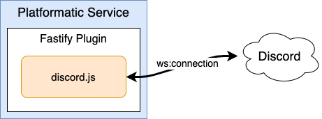

# discord-bot-playground

A simple discord bot playground.
It does nothing, it's just a playground.

## Commands

- `/ping`: replies with `pong!`

## Architecture

- It is deployed on [Platformatic](https://platformatic.cloud/).

## Development

To run it locally you need to create a `.env` file with the variables listed in `.env.sample`.

## License

Copyright [Manuel Spigolon](https://github.com/Eomm), Licensed under [MIT](./LICENSE).
